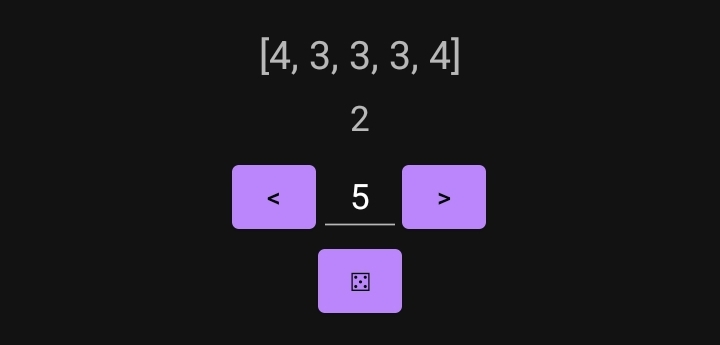
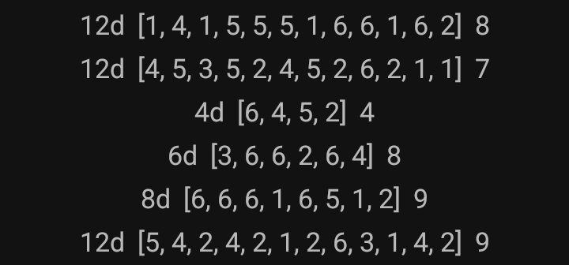

# DICE DICE DICE
> "Messing around with Android development I guess"

Simple Android app to play Prowlers & Paragons, niche tabletop RPG with unique dice mechanics.
I made this because most *(if not all)* dice apps are completely D&D-focused, and I wanted to host a session or two of this game.

If you're not familiar, Prowlers is a d6 pool system. 2s and 4s contribute 1 point towards success, and 6s contribute 2.

## How to Use
*make sure to `./gradlew build` if this is your first Java/Kotlin clone :)*

Choose how many dice you want to roll in your pool. The buttons let you "scroll" for small changes, but it's a full-featured number box so you can tap it and put in a specific number if you want.

The output consists of the results of the simulated dice, and the total below it.

Previous rolls are saved just below in a short list.

